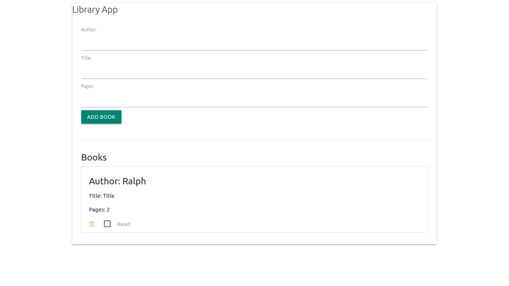

# Book Library

This a project to create a webapp that acts as a personal library to save books you have read or to create a list of books to read.

## Library screenshot

In this project we build a simple library app with vanilla javascript where you can:

- Add books
- Remove Books
- Mark added books as read

## Built With

- JavaScript
- HTML
- CSS

## Getting Started

To set up a local copy of the project

- `git clone git@github.com:akshay-narkar/Library-App.git`
- `cd Library-App`

## Live Link of the project

[Live-Library](https://rawcdn.githack.com/akshay-narkar/Library-App/4df667587a7695085bb3bbb87c7df4d1515ac0c8/index.html)

## Author

👤 **Ralph Oburu**

- Github: [Ralph-1](https://github.com/Ralph-1)
- Twitter: [@NotRalph0](https://twitter.com/NotRalph0)
- Linkedin: [Ralph](https://www.linkedin.com/in/ralph-oburu-092a561b1/)

👤 **Akshay Narkar**

- Github: [@akshay-narkar](https://github.com/akshay-narkar)
- Twitter: [Akshay](https://www.twitter.com/akidoit)
- Linkedin: [Akshay Narkar](https://www.linkedin.com/in/akshaynarkar25/)

## 🤝 Contributing

Contributions, issues, and feature requests are welcome!

## Show your support

Give a ⭐️ if you like this project!

## Acknowledgments

- Thanks to Odin project for the tutorials.
- Wes Bos and Brad Traversy for their informative videos.

## 📝 License

This project is [MIT](LICENSE) licensed.
